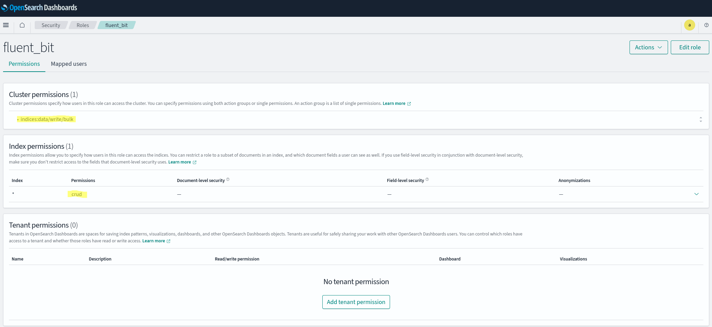
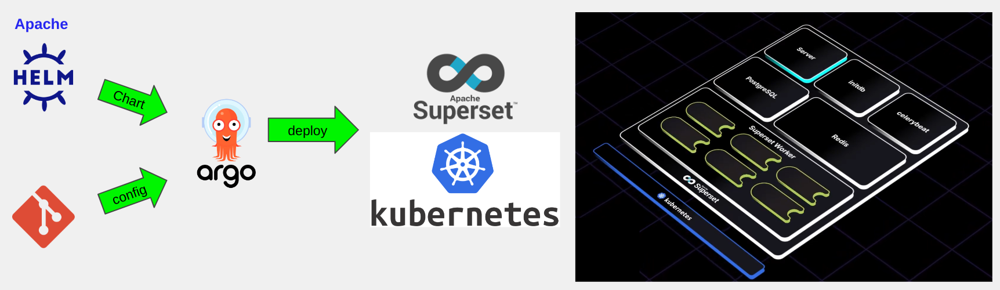

# Provisioning with IaC and Deployment with GitOps

## Provisioning an EKS cluster using Terraform

(Adapted from https://www.youtube.com/watch?v=KE504NwP9vs)  

Disclaimer:
**Please notice that this repo installs AWS resources beyond the Free Tier.**  
  
You need to read the [Installing Fluent Bit and connecting to OpenSearch](#installing-fluent-bit-and-connecting-to-opensearch) section before starting.

- to provision the environment, run `scripts/provision.sh`
- to destroy the environment, run `scripts/destroy.sh`

### Further References

https://developer.hashicorp.com/terraform/tutorials/kubernetes/eks  
 
https://aws.amazon.com/blogs/aws/introducing-karpenter-an-open-source-high-performance-kubernetes-cluster-autoscaler/  

https://aws-quickstart.github.io/cdk-eks-blueprints/addons/cluster-autoscaler/  

Why Karpenter:  
https://www.youtube.com/watch?v=C-2v7HT-uSA  

[Karpenter graduates to beta | Amazon Web Services](https://aws.amazon.com/blogs/containers/karpenter-graduates-to-beta/)

[NodeClasses](https://karpenter.sh/docs/concepts/nodeclasses/)

[NodePools](https://karpenter.sh/docs/concepts/nodepools/)

[General purpose node class](https://github.com/aws/karpenter-provider-aws/blob/main/examples/v1beta1/general-purpose.yaml)

[helm values.yaml](https://github.com/aws/karpenter-provider-aws/blob/main/charts/karpenter/values.yaml)

[v1beta1-controller-policy.json](https://github.com/aws/karpenter-provider-aws/blob/main/website/content/en/preview/upgrading/v1beta1-controller-policy.json)

[Karpenter terraform module example](https://github.com/terraform-aws-modules/terraform-aws-eks/blob/master/examples/karpenter/main.tf)

EKS Blueprints for Terraform v5:  
https://aws-ia.github.io/terraform-aws-eks-blueprints/v4-to-v5/motivation/  

Most notably:  
>With this shift in direction, the cluster definition will be removed from the project and instead examples will reference the terraform-aws-eks module for cluster creation. The remaining modules will be moved out to their own respective repositories as standalone projects.  

AWS EKS Terraform module:  
https://github.com/terraform-aws-modules/terraform-aws-eks

EKS Blueprints Addons:  
https://github.com/aws-ia/terraform-aws-eks-blueprints-addons 

https://aws.amazon.com/ec2/instance-types/t3/

https://docs.aws.amazon.com/eks/latest/userguide/sec-group-reqs.html 

Configure EBS policy on EKS nodes:  
https://github.com/ElliotG/coder-oss-tf/blob/main/aws-eks/main.tf  

Cluster Autoscaler:  
https://github.com/kubernetes/autoscaler/blob/master/cluster-autoscaler/cloudprovider/aws/README.md  

https://docs.aws.amazon.com/eks/latest/userguide/add-user-role.html


## Installing Prometheus Agent and Graphana

(Adapted from https://www.youtube.com/watch?v=-nUQNFAX5TI)  

This project is going to provision an AWS Managed Prometheus workspace named `prometheus-eks`. It's algo going to deploy Grafana to the cluster.

To access it, type in on a terminal:
```
kubectl -n monitoring port-forward service/kube-prometheus-stack-grafana 3000
```
Then open your browse at `http://localhost:3000` and log on with `admin` user and `admin` password.

### Architecture Overview


### Further References

#### Prometheus
https://prometheus.io/docs/introduction/overview/  
  
https://aws.amazon.com/blogs/mt/getting-started-amazon-managed-service-for-prometheus/  


EKS blueprints addons - Terraform Prometheus stack:  
https://registry.terraform.io/modules/aws-ia/eks-blueprints-addons/aws/latest  
https://registry.terraform.io/modules/sparkfabrik/prometheus-stack/sparkfabrik/latest  (alternative) Repo  
  
Prometheus Agent:  
https://github.com/prometheus-operator/prometheus-operator/blob/main/Documentation/designs/prometheus-agent.md  

Remote Write:  
https://grafana.com/docs/grafana-cloud/monitor-infrastructure/kubernetes-monitoring/configuration/configure-infrastructure-manually/prometheus/remote-write-operator/  
  
kube-prometheus-stack default values:  
https://github.com/prometheus-community/helm-charts/blob/main/charts/kube-prometheus-stack/values.yaml  
  
Managed Prometheus workspace:  
https://registry.terraform.io/providers/hashicorp/aws/latest/docs/resources/prometheus_workspace  
  
https://aws.amazon.com/prometheus/pricing/  

#### Grafana:
Default values and format:  
https://github.com/grafana/helm-charts/blob/main/charts/grafana/values.yaml  
  
Solving two default dashboards issue:  
https://github.com/prometheus-community/helm-charts/issues/2251#issuecomment-1178789922  
  
Solving SigV4 authentication issue:  
https://github.com/prometheus-community/helm-charts/issues/2092#issuecomment-1140317696  

## Installing Fluent Bit and connecting to OpenSearch

This project is going to deploy Fluent Bit to the cluster. To have access to the logs, you need to create an OpenSearch domain on AWS and configure: 
- the `opensearch_domain` TF variable with your `Domain endpoint` without the schema (`https://`)
- the `opensearch_arn` TF variable with your OpenSearch domain ARN  

Don't forget to give the IAM role being used by Fluent Bit the proper access rights in the OpenSearch console if you are using [Fine-grained access control](https://docs.aws.amazon.com/opensearch-service/latest/developerguide/fgac.html).



After running `scripts/provision.sh`, go to your OpenSearch dashboard and look for `poc-eks` indice.

### References

#### Fluent-bit
  
https://docs.fluentbit.io/manual/installation/kubernetes
  
https://aws.amazon.com/blogs/containers/kubernetes-logging-powered-by-aws-for-fluent-bit/
  
https://www.youtube.com/watch?v=KJlWV5-o8v0
  
[Fluent-bit via Terraform](https://www.youtube.com/watch?v=kUyLghPG2AI)

https://github.com/aws/aws-for-fluent-bit/issues/286
  
Fluent-bit helm values:  
https://github.com/fluent/helm-charts/blob/main/charts/fluent-bit/values.yaml

aws-for-fluent-bit helm values:  
https://github.com/aws/eks-charts/blob/master/stable/aws-for-fluent-bit/README.md
  

https://github.com/aws/aws-for-fluent-bit/blob/mainline/ecs/amazon-es.conf

https://github.com/quickbooks2018/terraform-aws-eks-logging/blob/79f8a96616d0239d7df28685acdc2747c622578f/main.tf

https://github.com/raj13aug/eks-fluentbit/blob/c433853899994ddb54d2782d6be804a9731d94f5/main.tf


https://www.studytonight.com/post/configure-fluent-bit-with-aws-elasticsearch-service

https://www.youtube.com/watch?v=E_P4EqJQ-T0

#### OpenSearch

[OpenSearchIdentity and Access Management in Amazon OpenSearch Service](https://docs.aws.amazon.com/opensearch-service/latest/developerguide/ac.html)

[Fine-grained access control in Amazon OpenSearch Service](https://docs.aws.amazon.com/opensearch-service/latest/developerguide/fgac.html)

https://docs.fluentbit.io/manual/pipeline/outputs/opensearch

[Using an OpenSearch Ingestion pipeline with Fluent Bit](https://docs.aws.amazon.com/opensearch-service/latest/developerguide/configure-client-fluentbit.html)

Couldn't use OpenSearch OUTPUT due to the error below:  
https://github.com/fluent/fluent-bit/issues/2714
  
I did manage to configure OpenSearch OUTPUT in aws-for-fluent-bit image using the values I found in the repo below:  
https://github.com/kabisa/terraform-aws-eks-cloudwatch/blob/6354db1244b719c31fd862e7142f116d08fcf894/yamls/fluentbit-values.yaml

## Installing ArgoCD

(Apated from https://www.youtube.com/watch?v=zGndgdGa1Tc)  

This project is going to deploy ArgoCD to the cluster.

To access its console, type in on a terminal:
```
kubectl port-forward svc/argocd-server -n argocd 8080:80
```
Then open your browse at `http://localhost:8080` and log on with `admin` user. To get the initial random password, type in on a console:
```
echo $(kubectl -n argocd get secret argocd-initial-admin-secret -o jsonpath="{.data.password}" | base64 -d)
```

To deploy applications to this cluster using ArgoCD, read the instructions in this [repo](https://github.com/dbaltor/argocd-test).


## Installing ArgoCD Vault Plugin

I've selected AVP because:  
- it doesn't require developers to manually encript secrets, such as:
 *Sealed Secrets* and *SOPs*
- it doesn't require installing additional components to the cluster, such as:  
  *ExternalSecrets* and *Secrets Store CSI Driver*
- it supports different external management solutions (a.k.a. backends). I've picked AWS Secrets Manager.
  
### References

https://itnext.io/introducing-argocd-vault-plugin-v1-0-708433294b2d

https://github.com/argoproj-labs/argocd-vault-plugin 

https://github.com/argoproj-labs/argocd-vault-plugin/blob/main/docs/installation.md

https://argocd-vault-plugin.readthedocs.io/en/stable/usage/

https://argocd-vault-plugin.readthedocs.io/en/stable/backends/

https://argocd-vault-plugin.readthedocs.io/en/stable/usage/#running-argocd-vault-plugin-in-a-sidecar-container

https://engineering.lightrun.com/argocd-aws-secrets-manager-3d625aa917f7

ttps://dev.to/luafanti/injecting-secrets-from-vault-into-helm-charts-with-argocd-49k


## Deploying Superset

In order to explore some of the advanced features provided by the products used in this repo, I've choosed to deploy a complex product: [Apache Superset](https://superset.apache.org/).



All configuration properties are stored [here](https://github.com/dbaltor/argocd-test/blob/master/environments/prod/superset/values.yaml). To access Superset after it has been deployed, add the line below to the `/etc/hosts` file of your machine:

```
<IP_ADDRESS>   superset.<dns_domain>
```
where <IP_ADDRESS> is one of the IP addresses returned by the following command:

```
kubectl get ingress -n superset -o=jsonpath='{.items[].status.loadBalancer.ingress[].hostname}' | nslookup
```

You can then point your browser at `https:\\superset.<DNS_DOMAIN>`.  
Log in with `admin` user and `admin` password.

**N.B.** Run the following command if the example dashboards don't load properly:
```
kubectl -n superset exec -it $(kubectl -n superset get pods --no-headers -o custom-columns=":metadata.name" | grep '^superset-.\{10\}-.\{5\}$') -- superset load-examples
```
See issue [here](https://github.com/apache/superset/issues/24521).

### References

#### Superset

https://superset.apache.org/docs/installation/running-on-kubernetes/

https://superset.apache.org/docs/installation/configuring-superset/

https://github.com/apache/superset/blob/master/helm/superset/values.yaml

#### Load balancing on Amazon EKS

https://kubernetes-sigs.github.io/aws-load-balancer-controller/v2.6/how-it-works/ 

https://docs.aws.amazon.com/eks/latest/userguide/alb-ingress.html 

https://docs.aws.amazon.com/eks/latest/userguide/network-load-balancing.html 

https://kubernetes-sigs.github.io/aws-load-balancer-controller/v2.6/guide/ingress/annotations/
https://dev.to/luafanti/injecting-secrets-from-vault-into-helm-charts-with-argocd-49k

## Provisioning AWS RDS

I've selected RDS for PostgreSQL.  

https://developer.hashicorp.com/terraform/tutorials/aws/aws-rds

https://registry.terraform.io/providers/hashicorp/random/latest/docs/resources/string
